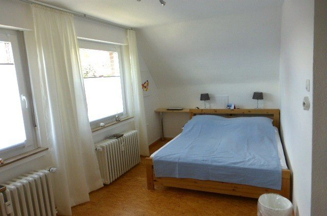
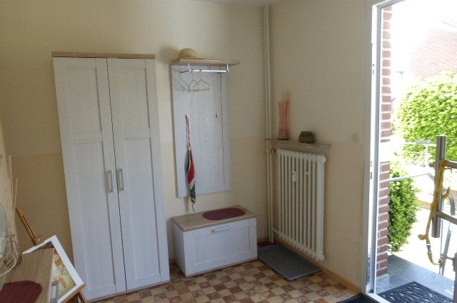

# Ferienwohnung Uekermann in Bad Bentheim
[English](https://translate.google.com/translate?hl=en&sl=de&u=http://www.ferienwohnung-bentheim.de)
[Nederlands](https://translate.google.com/translate?hl=nl&sl=de&u=http://www.ferienwohnung-bentheim.de)

Die freundliche, helle Wohnung mit eigenem Eingang ist modern ausgestattet und ca. 65 m² groß. Sie liegt in ruhiger Lage südlich des Stadtzentrums. Zur Burg und zur Stadtmitte sind es 5 - 10 Fußminuten. Dort findet man auch Restaurants. Ein Einkaufsmarkt ist in Wohnungsnähe, etwa 5 Fußminuten entfernt. 
Zur Wohnung gehört ein PKW-Stellplatz. Ein überdachter Fahrradabstellplatz mit Lademöglichkeit für E-Bikes befindet sich im Garten hinter dem Haus. Dort steht für Feriengäste auch ein Tisch mit Sitzmöglichkeiten. 

| Wohnungsadresse | Blumenstraße 1, 48455 Bad Bentheim |
|---|---|
| Ansprechpartner | Jutta Sander-Uekermann & Jürgen Uekermann |
| Anschrift | Gartenstraße 13, 48455 Bad Bentheim |
| wo: | direkt über der Blumenstraße 1 |
| Telefon | +49 5922 994150 oder +49 172 52 59 832 |
| Email | ju1@uekermann-online.de |

<iframe src="https://www.google.com/maps/embed?pb=!1m18!1m12!1m3!1d19517.44833497922!2d7.117022113737484!3d52.303643405507295!2m3!1f0!2f0!3f0!3m2!1i1024!2i768!4f13.1!3m3!1m2!1s0x47b83b395889d7dd%3A0x4cb8ef3ff6ccd130!2sFerienwohnung+Uekermann!5e0!3m2!1sen!2sdk!4v1509103460050" width="400" height="300" frameborder="0" style="border:0" allowfullscreen></iframe>

## Buchungsbedingung und Preise

Die Wohnung ist für 1 - 3 Personen geeignet. Die Mindestmietdauer ist 2 Tage.

Jeder Gast muss einen Lichtbildausweis bei der Buchung vorlegen. 

| Mietpreis pro Tag für 1 oder 2 Personen | 50,00€ |
|---|---|
| Aufpreis für eine dritte Person | 10,00€ |
| Rabat für Buchungsdauer ab einer Woche | 10% |
| Rabat für Buchungsdauer ab einem Monat | 35% |
| Zusätzliche Reinigungsgebühr | 20,00€ |

## Hausregeln

* Check-in-Zeit ist 15:00–20:00 Uhr
* Check-out bis 11:00
* Rauchen verboten
* Nicht für Haustiere geeignet
* Keine Partys oder Veranstaltungen
* Nicht geeignet für Kinder (0–12 Jahre)

## Kurbeitrag / Gästekarte

Der Kurbeitrag muss von jedem Gast am Tag nach der Ankunft an den Wohnungsgeber entrichtet werden. Er wird an die Stadt weitergeleitet. Dafür erhält jeder Gast eine Gastkarte. Mit dieser Gastkarte kann man kostenlos an der öffentlichen Stadtführung  und dem Nachtwächterrundgang teilnehmen. Darüber hinaus gibt es unter anderem Preisreduzierungen für öffentliche Busfahrten, Eintritt in den Badepark und in die Mineraltherme.

| Kurbeitrag | |
|---|---|
| Erwachsene (ab 18 Jahre) | 1,50€ |
| Kinder, Jugendliche (5 - 17 Jahre) | 0,75€ |

## Wohnung

Der Eingang befindet sich im Erdgeschoss. Über eine Treppe gelangt man in den Flur der Wohnung in der 1. Etage.
Dort befinden sich Schlafzimmer, Badezimmer, Küche und ein großes Wohnzimmer.

Schlafzimmer:

* Schrankregal mit Kleiderstange und Schrankfächern
* Doppelbett (Bettwäsche ist vorhanden)
* Sessel mit kleinem Tisch

Badezimmer:

* Dusche, WC, Waschbecken
* Handtücher
* Ablegefächer
* Fön
* Kosmetikspiegel

Küche:

* Einbauküche mit
    * Ceran-Kochfeld
    * Backofen
    * Edelstahlspüle 
* Kühlschrank mit Eisfach
* Espressokanne, Teekocher, Kaffeemaschine, Toaster, Bügeleisen etc. 

Großes L-förmiges Wohnzimmer:
* Essecke mit Tisch und Stühlen
* Vitrinenschrank mit Geschirr
* Couchgarnitur und Sessel
* Satelliten-TV mit Plasma-Bildschirm
* Radio mit CD-Player
           
## Bilder

### Schlafzimmer

 

### Wohnzimmer

  

### Küche und Flur im Dachgeschoss

  

### Bad 

  

### Eingangsbereich im Erdgeschoss

 

[Impressum](/impressum)
